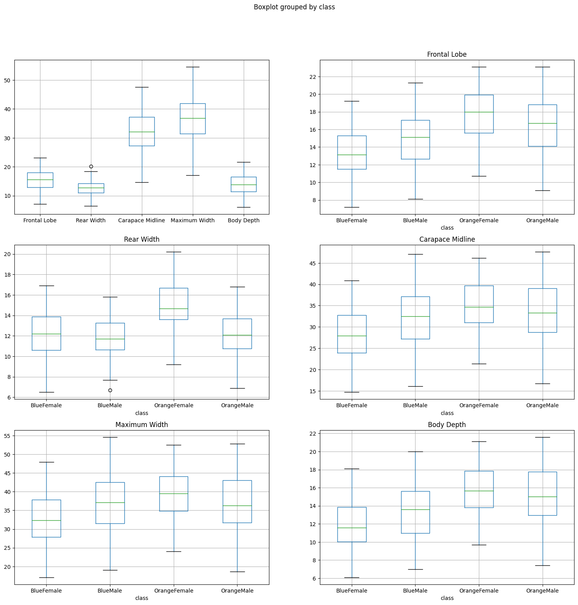
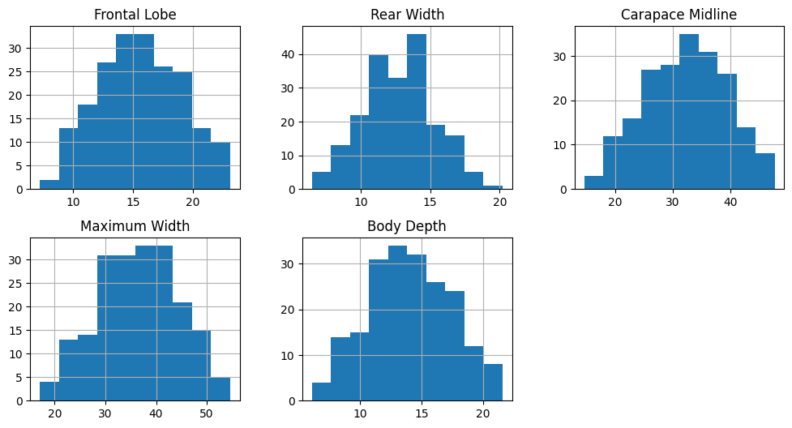
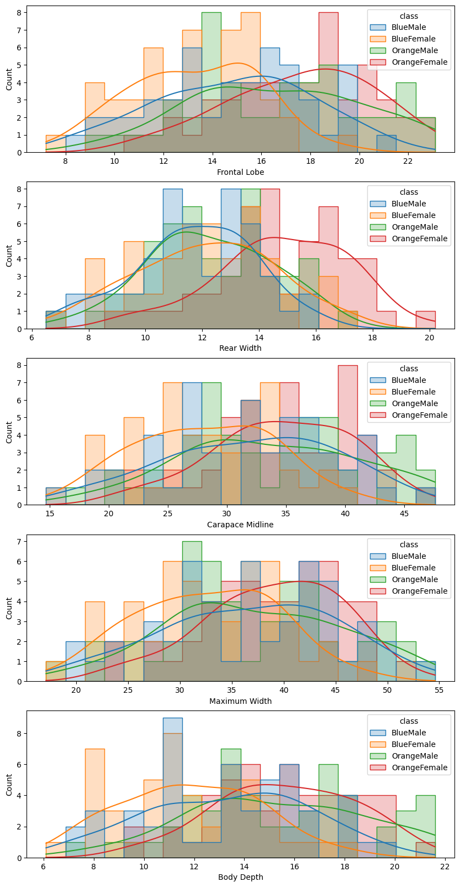
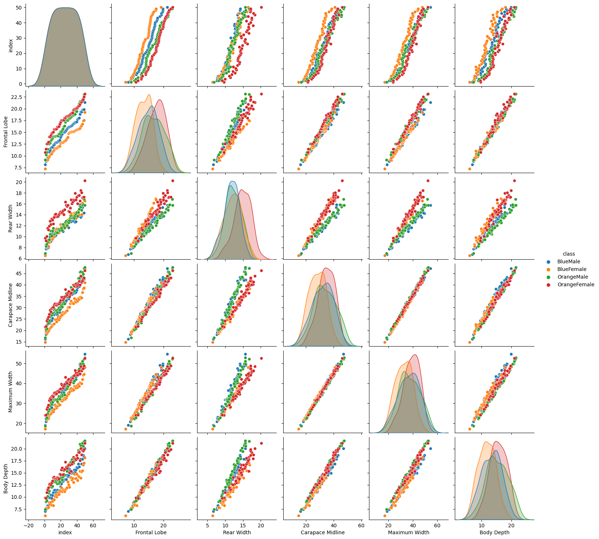
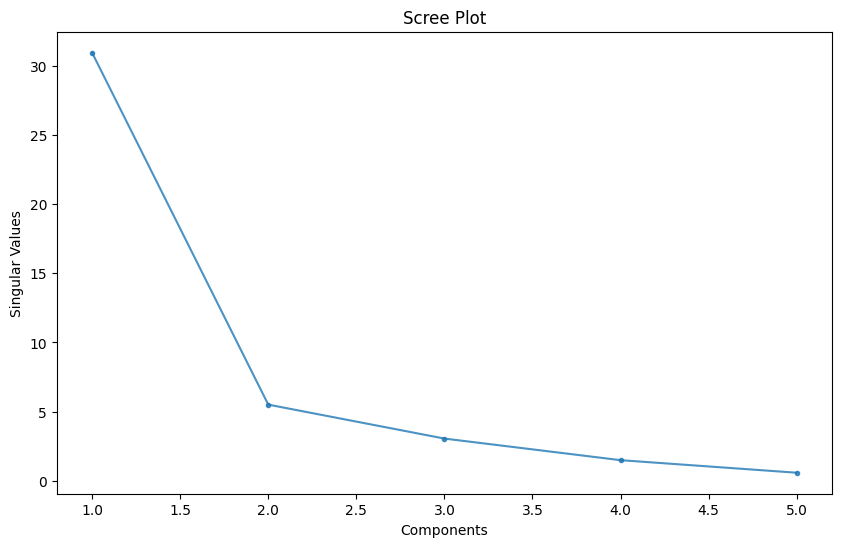
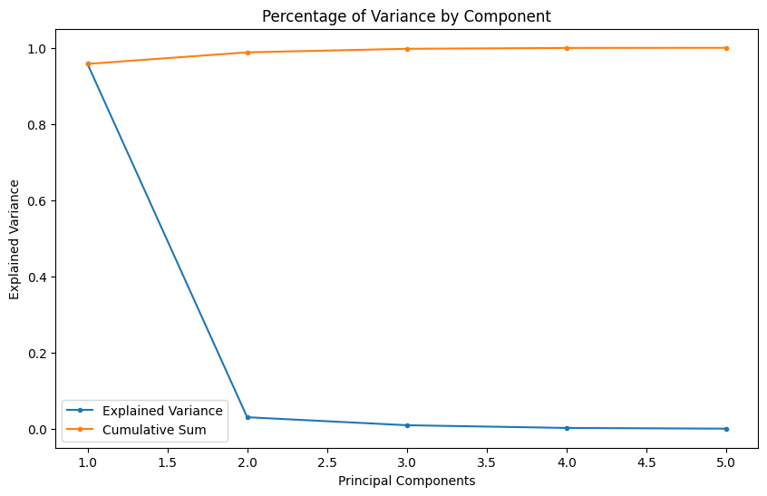
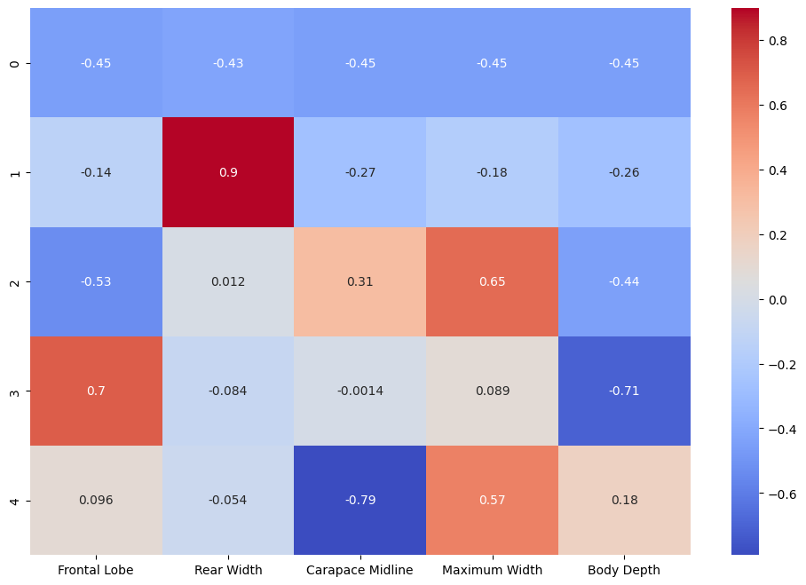
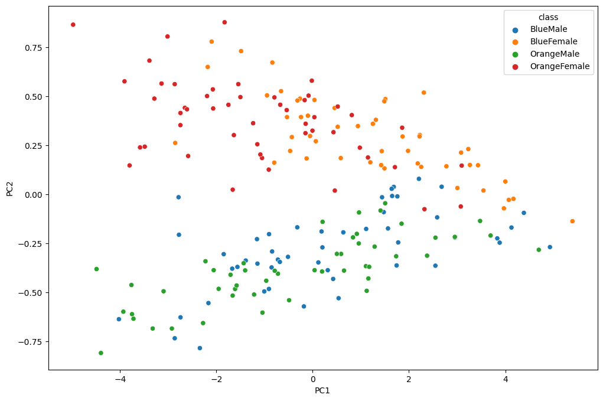
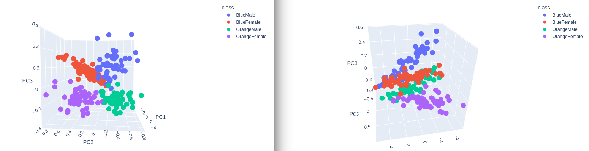
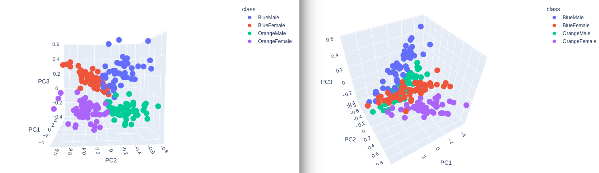

---
jupyter:
  jupytext:
    formats: ipynb,md
    text_representation:
      extension: .md
      format_name: markdown
      format_version: '1.3'
      jupytext_version: 1.14.4
  kernelspec:
    display_name: Python 3 (ipykernel)
    language: python
    name: python3
---

# Dimensionality Reduction

Simplify your data to visualize relationships between classes.

> [A multivariate study of variation in two species of rock crab of the genus Leptograpsus](https://www.researchgate.net/publication/243766527_A_multivariate_study_of_variation_in_two_species_of_rock_crab_of_genus_Leptograpsus)

```python
# dependencies
import io
import matplotlib.pyplot as plt
from mpl_toolkits.mplot3d import Axes3D
import pandas as pd
import plotly.express as px
import seaborn as sns

from sklearn import set_config
set_config(display='text') # display estimators as text

from sklearn.preprocessing import StandardScaler
from sklearn.decomposition import PCA
```

## Dataset

```python
pd.set_option('display.precision', 3)
leptograpsus_data = pd.read_csv('data/A_multivariate_study_of_variation_in_two_species_of_rock_crab_of_genus_Leptograpsus.csv')
leptograpsus_data.head()
```

|   | sp | sex | index | FL | RW | CL | CW | BD |
| -- | -- | -- | -- | -- | -- | -- | -- | -- |
| 0 | B | M | 1 | 8.1 | 6.7 | 16.1 | 19.0 | 7.0 |
| 1 | B | M | 2 | 8.8 | 7.7 | 18.1 | 20.8 | 7.4 |
| 2 | B | M | 3 | 9.2 | 7.8 | 19.0 | 22.4 | 7.7 |
| 3 | B | M | 4 | 9.6 | 7.9 | 20.1 | 23.1 | 8.2 |
| 4 | B | M | 5 | 9.8 | 8.0 | 20.3 | 23.0 | 8.2 |


### Preprocessing

```python
data = leptograpsus_data.rename(columns={
    'sp': 'species',
    'FL': 'Frontal Lobe',
    'RW': 'Rear Width',
    'CL': 'Carapace Midline',
    'CW': 'Maximum Width',
    'BD': 'Body Depth'})

data['species'] = data['species'].map({'B':'Blue', 'O':'Orange'})
data['sex'] = data['sex'].map({'M':'Male', 'F':'Female'})

data.head()
```

|   | species | sex | index | Frontal Lobe | Rear Width | Carapace Midline | Maximum Width | Body Depth |
| -- | -- | -- | -- | -- | -- | -- | -- | -- |
| 0 | Blue | Male | 1 | 8.1 | 6.7 | 16.1 | 19.0 | 7.0 |
| 1 | Blue | Male | 2 | 8.8 | 7.7 | 18.1 | 20.8 | 7.4 |
| 2 | Blue | Male | 3 | 9.2 | 7.8 | 19.0 | 22.4 | 7.7 |
| 3 | Blue | Male | 4 | 9.6 | 7.9 | 20.1 | 23.1 | 8.2 |
| 4 | Blue | Male | 5 | 9.8 | 8.0 | 20.3 | 23.0 | 8.2 |

```python
data.shape
# (200, 8)

data_columns = ['Frontal Lobe',
                'Rear Width',
                'Carapace Midline',
                'Maximum Width',
                'Body Depth']

data[data_columns].describe()
```

| Frontal Lobe | Rear Width | Carapace Midline | Maximum Width | Body Depth |
| -- | -- | -- | -- | -- |
| 200.000 | 200.000 | 200.000 | 200.000 | 200.000 | 200.000 |
| 25.500 | 15.583 | 12.800 | 32.100 | 36.800 | 13.900 |
| 14.467 | 3.495 | 2.573 | 7.119 | 7.872 | 3.425 |
| 1.000 | 7.200 | 6.500 | 14.700 | 17.100 | 6.100 |
| 13.000 | 12.900 | 11.000 | 27.275 | 31.500 | 11.400 |
| 25.500 | 15.550 | 12.800 | 32.100 | 36.800 | 13.900 |
| 38.000 | 18.050 | 14.300 | 37.225 | 42.000 | 16.600 |
| 50.000 | 23.100 | 20.200 | 47.600 | 54.600 | 21.600 |


The dataset now needs to be segmented into __4 Classes__ for sex (`male`, `female`) and species (`blue`, `orange`). We can add this identifier as an additional row to our dataset inform of a concatenate value from the species and sex feature:

```python
data['class'] = data.species + data.sex
data['class'].value_counts()
```

The entire dataset has a size of `200` and each class is equally represented with `50` specimens:

* BlueMale :        __50__
* BlueFemale :      __50__
* OrangeMale :      __50__
* OrangeFemale :     __50__

Name: class, dtype: int64


### Visualization

#### Boxplots

```python
# plot features vs classes
fig, axes = plt.subplots(nrows=3, ncols=2, figsize=(18,18))
data[data_columns].boxplot(ax=axes[0,0])
data.boxplot(column='Frontal Lobe', by='class', ax=axes[0,1])
data.boxplot(column='Rear Width', by = 'class', ax=axes[1,0])
data.boxplot(column='Carapace Midline', by='class', ax=axes[1,1])
data.boxplot(column='Maximum Width', by = 'class', ax=axes[2,0])
data.boxplot(column='Body Depth', by = 'class', ax=axes[2,1])
```




While the orange and blue female show a good separation in several features the male counterparts are very close together. The __Body Depth__ and __Frontal Lobe__ dimensions are the best features to differentiate both species in the male sub class.


#### Histograms

```python
data[data_columns].hist(figsize=(12,6), layout=(2,3))
```



```python
fig, axes = plt.subplots(nrows=5, ncols=1, figsize=(10,20))
sns.histplot(data, x='Frontal Lobe', hue='class', kde=True, element='step', bins=20, ax=axes[0])
sns.histplot(data, x='Rear Width', hue='class', kde=True, element='step', bins=20, ax=axes[1])
sns.histplot(data, x='Carapace Midline', hue='class', kde=True, element='step', bins=20, ax=axes[2])
sns.histplot(data, x='Maximum Width', hue='class', kde=True, element='step', bins=20, ax=axes[3])
sns.histplot(data, x='Body Depth', hue='class', kde=True, element='step', bins=20, ax=axes[4])
```




Again, the orange and blue coloured distributions - representing the females of the orange and blue species - are well seperated. But there is a large overlap between the male counterparts. We can see that while the boxplot still showed a visible difference in the __Frontal Lobe__ and __Body Depth__ mean value, it is much harder to differentiate the histrograms.


#### Pairplot

```python
sns.pairplot(data, hue='class')
# sns.pairplot(data, hue='class', diag_kind="hist")
```




The pairplot plots the relationships of each pair of features. We can see that there are several plots that separate between our female and male classes. For example the __Rear Width__ separates the green/blue (male) dots from the orange/red (female) ones. There is some separation between both female species (red/orange dots) in the __Frontal Lobe__ and __Body Depth__ graphs. But again, it is hard to separate both male species - there is always a strong overlap between the blue and green dots.


## Principal Component Analaysis

A PCA is a reduction technique that transforms a high-dimensional data set into a new lower-dimensional data set. At the same time, preserving the maximum amount of information from the original data.

```python
# Normalize data columns before applying PCA
data_norm = data.copy()
data_norm[data_columns] = StandardScaler().fit_transform(data[data_columns])
data_norm.describe().T
```

Normalization sets the mean of all data columns to ~`0` and the standard deviation to ~`1`:

|  | count | mean | std | min | 25% | 50% | 75% | max |
| -- | -- | -- | -- | -- | -- | -- | -- | -- |
| index | 200.0 | 2.550e+01 | 14.467 | 1.000 | 13.000 | 2.550e+01 | 38.000 | 50.000 |
| Frontal Lobe | 200.0 | -7.105e-17 | 1.003 | -2.404 | -0.770 | -9.465e-03 | 0.708 | 2.156 |
| Rear Width | 200.0 | 6.040e-16 | 1.003 | -2.430 | -0.677 | 2.396e-02 | 0.608 | 2.907 |
| Carapace Midline | 200.0 | 1.066e-16 | 1.003 | -2.451 | -0.680 | -7.745e-04 | 0.721 | 2.182 |
| Maximum Width | 200.0 | -4.974e-16 | 1.003 | -2.460 | -0.626 | 4.909e-02 | 0.711 | 2.316 |
| Body Depth | 200.0 | 0.000e+00 | 1.003 | -2.321 | -0.770 | -3.820e-02 | 0.752 | 2.216 |

```python
# number of classes = 5
no_components = 5
principal = PCA(n_components = no_components)
principal.fit(data_norm[data_columns])

data_transformed=principal.transform(data_norm[data_columns])
print(data_transformed.shape)
# (200, 5)

singular_values = principal.singular_values_
variance_ratio = principal.explained_variance_ratio_
# show variance vector for each dimension
print(variance_ratio)
print(variance_ratio.cumsum())
print(singular_values)
```

| | Frontal Lobe | Rear Width | Carapace Midline | Maximum Width | Body Depth |
| -- | -- | -- | -- | -- | -- |
| Explained Variance | 9.57766957e-01 | 3.03370413e-02| 9.32659482e-03 | 2.22707143e-03 | 3.42335531e-04 |
| Cumulative Sum | 0.95776696 | 0.988104 | 0.99743059 | 0.99965766 | 1. |
| Singular Values | 30.94781021 | 5.50790717 | 3.05394742 | 1.49233757 | 0.58509446 |

Adding variables to our model can increase our models performance if the added variable adds explanatory power. Too many variables, especially non-correlating or noisy dimensions, can lead to overfitting. As seen above, already using 2 (`98.8%`) or 3 (`99.7%`) of our 5 classes allows us to describe our dataset with a high accuracy - the additional 2 will not add much value.


### Scree Plot

A Scree plot is a graph useful to plot the eigenvectors. This plot is useful to determine the PCA. It orders the values in descending order that is from largest to smallest. It allows us to determine the number of Principal Component is a graphical representation by visualizing the amount of variation a value adds to a given dataset.

```python
fig = plt.figure(figsize=(10, 6))
plt.plot(range(1, (no_components+1)), singular_values, marker='.')
y_label = plt.ylabel('Singular Values')
x_label = plt.xlabel('Principal Components')
plt.title('Scree Plot')
```

 According to the scree test, the "elbow" of the graph where the eigenvalues seem to level off is found and factors or components to the left of this point should be retained as significant - here this would be the first two or three classes:
    


```python
fig = plt.figure(figsize=(10, 6))

plt.plot(range(1, (no_components+1)), variance_ratio, marker='.', label='Explained Variance')
plt.plot(range(1, (no_components+1)), variance_ratio.cumsum(), marker='.', label='Cumulative Sum')

y_label = plt.ylabel('Explained Variance')
x_label = plt.xlabel('Principal Components')
plt.title('Percentage of Variance by Component')
plt.legend()
```

The values of the amount of variance a component brings to our dataset and it's cumulative sum shows the same 'elbow' to pick our principal components from:
    



### Component PCA Weights

Our Principal Component Analysis assigned weights to each component allowing us to discard components that do not help us to classify the species in our dataset. Those weights can be visualized in a heatmap:

```python
fig = plt.figure(figsize=(12, 8))
sns.heatmap(
    principal.components_,
    cmap='coolwarm',
    xticklabels=list(data.columns[3:-1]),
    annot=True)
```




## Transformation and Visualization

```python
# use 3 principal components out of the 5 components
print(data_transformed[:,:3])

# append the 3 principal components to the norm dataframe
data_norm[['PC1', 'PC2', 'PC3']] = data_transformed[:,:3]

data_norm.head()
```

|  | species | sex | index | Frontal Lobe | Rear Width | Carapace Midline | Maximum Width | Body Depth | class | PC1 | PC2 | PC3 |
| -- | -- | -- | -- | -- | -- | -- | -- | -- | -- | -- | -- | -- |
| 0 | Blue | Male | 1 | -2.146 | -2.352 | -2.254 | -2.218 | -2.058 | BlueMale | 4.928 | -0.268  | -0.122 |
| 1 | Blue | Male | 2 | -1.945 | -1.963 | -1.972 | -1.989 | -1.941 | BlueMale | 4.386 | -0.094  | -0.039 |
| 2 | Blue | Male | 3 | -1.831 | -1.924 | -1.846 | -1.785 | -1.853 | BlueMale | 4.129 | -0.169  | 0.034 |
| 3 | Blue | Male | 4 | -1.716 | -1.885 | -1.691 | -1.696 | -1.707 | BlueMale | 3.884 | -0.246  | 0.015 |
| 4 | Blue | Male | 5 | -1.659 | -1.846 | -1.662 | -1.708 | -1.707 | BlueMale | 3.834 | -0.224  | -0.015 |


### 2D Plot

```python
fig = plt.figure(figsize=(12, 8))
_ = sns.scatterplot(x='PC1', y='PC2', hue='class', data=data_norm)
```




### 3D Plot

```python
class_colours = {
    'BlueMale': '#0027c4', #blue
    'BlueFemale': '#f18b0a', #orange
    'OrangeMale': '#0af10a', # green
    'OrangeFemale': '#ff1500', #red
}

colours = data['class'].apply(lambda x: class_colours[x])

x=data_norm.PC1
y=data_norm.PC2
z=data_norm.PC3

fig = plt.figure(figsize=(10,10))
ax = fig.add_subplot(projection='3d')

ax.scatter(xs=x, ys=y, zs=z, s=50, c=colours)
```

```python
plot = px.scatter_3d(
    data_norm,
    x = 'PC1',
    y = 'PC2',
    z='PC3',
    color='class')

plot.show()
```






Separation! Nice :)

```python

```
